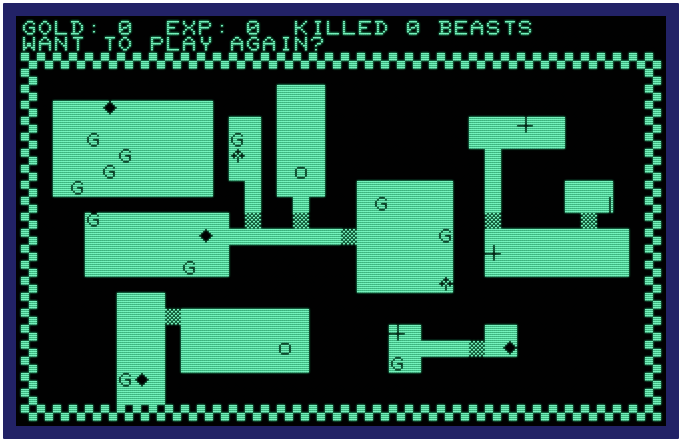
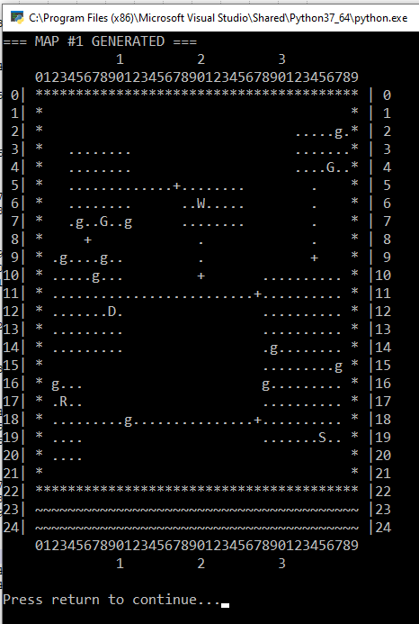

# PyDungeon

UPDATE: 6/5/20 - With this last checkin and merge to master branch, I've achieved all my goals.
- understanding the 1979 Commodore BASIC code
- implemented (mostly) as-is in Python
- improve code to more modern approach
- fix bugs, make small tweaks.

If I started to do more, like add more features, I might as well make a rogue clone. And that's not really the purposes of this. If you're checking out my code, I hope you enjoy! If you have comments/questions, you can get ahold of me at chgowiz@gmail.com

------

This is a project to recreate DUNGEON - a graphical dungeon crawler developed by Brian Sawyer for Cursor Magazine, issue #15. It was my very first computer D&D game, at a time when I had just started reading and playing the tabletop roleplaying game. DUNGEON was an eye-opener to me at the time (1979/1980).

I'm attempting to recreate the game based on the source code, implemented in Python. Obviously, some things will be very different - the Commodore PET implemented a crude, but effective graphics mode which DUNGEON took advantage of. No such luck in console-based Python! I have vague dreams of figuring out the basic algorithms and then implementing using something a bit more graphical. We'll see..

The source code from the original game is in the repo, and my comments on both an annotated copy of the source and the Python code should hopefully give some insights into what Messr. Sawyer had to do in order to implement this game on the old PET! I hope you enjoy this as much as I do.

## Prerequisites

### Unix (Linux, OS X)

The game should run out of the box. Just run the game as described below.

### Windows

- [Python 3](https://www.python.org/) is needed
- The Curses library for windows is needed. Run `pip install -r requirements-win.txt` once before the first start of the game.

## To run:

- Under Unix: `python3 ./pydungeon.py`
- Under Windows should be `.\pydungeon.py` enough

|CBM PET DUNGEON|PyDungeon (dungeon memory map dump)|
:--------------:|:-----------------:
|
